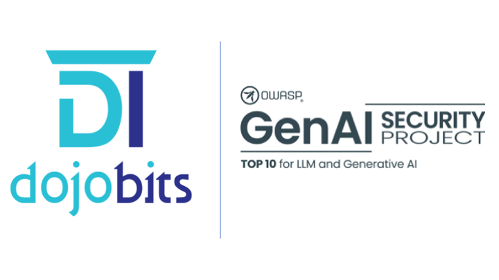

# OWASP Top 10 For Agentic Applications Hands-On workshop

A hands-on workshop on securing AI agents, focused on **ASI02: Tool Misuse & Exploitation** from the OWASP Top 10 for Agentic Applications. You will attack a tool-using AI agent, then harden it. Full step-by-step instructions are in the [workshop guide](https://github.com/DojoBits/sap-summit-2026/tree/main/workshop-guide).

Delivered by **DojoBits**

🔗 **Workshop Repository** [SAP Security and Compliance Expert Summit](https://github.com/DojoBits/sap-summit-2026)

---

# 👋 Welcome

An enterprise hands-on workshop focused on **securing agentic AI applications**: LLM-powered agents that can read files, run commands, query databases, and send email through "tools."

The workshop demonstrates a real attack class, **ASI02: Tool Misuse**, where an attacker manipulates an agent into abusing its own legitimate tools to leak secrets, run destructive commands, and dump customer data, then shows the defenses that stop it.

## 🚀 Workshop Highlights

- Build and run **DevBot**, a small tool-using AI agent, and watch it turn plain English into tool calls.
- Execute three real attacks: **indirect prompt injection**, **excessive agency**, and **SQL/parameter injection**.
- See why **model alignment alone is not a control you own**, using a live Amazon Bedrock model.
- **Harden the agent** at the tool boundary (least privilege, allowlists, parameterized queries, human-in-the-loop) and confirm the attacks now fail.

# 🛠 Workshop Environment

The workshop environment is based on:

- An **Amazon EC2 instance** (one per participant) running Ubuntu, accessed over SSH.
- A self-contained Python lab (no GPU required) that runs on a free deterministic **mock** model by default, with optional **Amazon Bedrock** (Nova / Claude) for the real-model exercise.

# 📋 Prerequisites

To successfully complete the workshop you will need:

- Web browser
- SSH client
  Examples:
  - OpenSSH
  - MobaXterm
  - PuTTY
- Internet connectivity to the lab environment
- Local administrator privileges on your machine

## 🧪 Hands-On Labs

The workshop includes hands-on exercises that take you through the full **attack → defend** lifecycle of an AI agent: using it normally, exploiting its tools three different ways, and then locking those tools down.

Participants can follow the full step-by-step instructions in the [workshop guide](https://github.com/DojoBits/sap-summit-2026/tree/main/workshop-guide)

## 🏢 About DojoBits

**DojoBits** was founded by **Iliyan Petkov** and **Valentin Hristev**, combining more than **20 years of experience** working with global technology companies including **Siemens AG, VMware, and HPE**.

The team has designed, deployed, and operated IT infrastructure at every scale, from single-server environments to **multi-million dollar private cloud platforms**.

Our mission is to help individuals and organizations adopt modern technologies through **practical expertise, innovation, and hands-on learning**. By sharing real-world operational knowledge, we aim to bridge the IT skills gap and empower teams to build reliable and scalable platforms.

Our vision is a future where **skills, innovation, and continuous learning drive technological progress** and enable businesses to solve complex challenges with confidence.

🌐 Website: [https://dojobits.io](https://dojobits.io)

## 🎓 Workshop Provider

This workshop is delivered by **DojoBits**, a training and consulting company specializing in:

- Kubernetes and Cloud Native platforms
- Red Hat OpenShift
- GitOps and DevOps automation
- Platform Engineering
- AI and Agentic Applications
